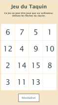

# 🧩 Jeu du Taquin (Puzzle) 

Le jeu du taquin, également appelé **puzzle de 15** ou **jeu de glissière**, est un jeu de plateau où le joueur doit réorganiser les pièces numérotées dans l'ordre croissant en les faisant glisser sur une grille. 

Ce jeu a été codé en JavaScript et est déployé sur Vercel: **[jouer en ligne au Taquin](https://taquin-ten.vercel.app/)**

---

## Aperçu 

<span style="display: flex;">
 
 
</span>

---

## 1. Installation 

```
git clone `https://github.com/Melissa-code/taquin.git`
cd taquin
Ouvrir le fichier index.html dans le navigateur pour commencer à jouer
```
---

## 2. Technologies utilisées

- **JavaScript** pour la logique du jeu
- **HTML** pour la structure de la page
- **CSS** pour le design et la mise en page
- **Local Storage** pour la sauvegarde et la reprise de la partie

---

## 3. Architecture et Patterns

### 3.1. Structure des fichiers :
```
taquin/
│── index.html  # Structure de la page
│── style.css  # Design du jeu
│── main.js   # Logique du jeu
```

### 3.2. Modèle de conception :

Le projet suit un pattern modulaire séparant la logique du jeu en fonctions indépendantes pour améliorer la maintenabilité et l'extensibilité du code: 

- **Modèle (Data)** : matrice de jeu (grid)
- **Vue** : displayGridHTML() pour l'affichage dynamique
- **Contrôleur** : processKey(event) pour gérer les interactions

---

## 4. Fonctionnalités principales

### 4.1. Génération des nombres aléatoires (randomNumbers())

Crée un tableau de nombres de 1 à 15 mélangés de manière aléatoire.

Utilise **l'algorithme de Fisher-Yates** pour un mélange sans doublon.


### 4.2. Création de la matrice de jeu (createMatrix())

Génère une grille 4×4 avec les nombres aléatoires (tableau à 2 dimensions: les données sont organisées en lignes et colonnes).

La dernière case (3,3) est mise à 0 pour représenter l'espace vide.

```
const grid = [
  [5, 3, 1, 7],
  [9, 2, 6, 4],
  [13, 10, 12, 8],
  [14, 11, 15, 0] // 0 représente l'espace vide
];
```

### 4.3. Affichage de la grille (displayGridHTML())

Convertit la matrice en tableau HTML interactif (dans `<table>`).

Met à jour l'affichage après chaque déplacement (n° de la matrice dans la case).


### 4.4. Détection de l’espace vide (findSpaceEmpty())

Parcourt la matrice et retourne la position (i, j) du 0.


### 4.5. Déplacement des cases (processKey(event))

Capture les touches ArrowUp, ArrowDown, ArrowLeft, ArrowRight.

Déplace le 0 en échangeant avec une case adjacente.


### 4.6. Vérification de victoire (checkGrid(matrix))

Vérifie si les nombres sont dans l'ordre croissant de 1 à 15 avec 0 à la fin.

La condition générale utilisée :

`matrix[i][j] = j + 1 + i * 4;`

car

```
i=0 et j=0 : case 1
i=0 et j=1 : case 2
i=0 et j=2 : case 3
i=0 et j=3 : case 4 -> donc matrice[i][j] = j+1 +0 
i=1 et j=0 : case 5 
i=1 et j=1 : case 6 -> donc matrice[i][j] = j+1 +4
i=2 et j=0 : case 9 -> donc matrice[i][j] = j+1 +8
i=3 j=0 : case 13 -> donc matrice[i][j] = j+1 + 12 
**donc si on généralise, la formule est :  matrice[i][j] = j+1 + i*4**
```

Exemple :
```
1  2  3  4  
5  6  7  8  
9 10 11 12  
13 14 15 0  
```

### 4.7. Sauvegarde et chargement de partie (saveGame() et loadGame())

Stocke la grille dans **Local Storage** pour conserver la progression.

Recharge la partie après un rafraîchissement.


### 4.8. Réinitialisation du jeu (resetGame())

Efface les données du Local Storage et recrée une grille de jeu aléatoire.

---

## 5. Algorithmique du jeu

### 5.1. Mélange des tuiles - Algorithme de Fisher-Yates

L’algorithme garantit que chaque permutation possible a une probabilité égale d’être générée :

```
function randomNumbers() {
    let numbers = [...Array(15).keys()].map(x => x + 1);
    for (let i = numbers.length - 1; i > 0; i--) {
        let j = Math.floor(Math.random() * (i + 1));
        [numbers[i], numbers[j]] = [numbers[j], numbers[i]];
    }
    return numbers;
}
```

### 5.2. Déplacement des tuiles - Gestion des indices

La position (i, j) de la case vide est trouvée.

L’échange se fait selon la direction choisie.

```
switch (event.key) {
  case 'ArrowUp':    swap(i, j, i + 1, j); break;
  case 'ArrowDown':  swap(i, j, i - 1, j); break;
  case 'ArrowLeft':  swap(i, j, i, j + 1); break;
  case 'ArrowRight': swap(i, j, i, j - 1); break;
}
```

swap : échanger deux cases dans la matrice du jeu:
```
function swap(i, j, x, y) {
    [grid[i][j], grid[x][y]] = [grid[x][y], grid[i][j]];
}
```

### 4.3. Vérification de la grille - Formule mathématique

La position correcte d’un nombre n dans une matrice 4×4 est définie par :

`expectedValue = j + 1 + i * 4;`

Si toutes les cases sont bien positionnées et que `matrix[3][3] == 0` alors la partie est gagnée.

---

## 5. Conclusion et objectif pédagogique

Le développement de ce jeu permet de voir plusieurs concepts fondamentaux en programmation et algorithmique :

- **Structures de données:** manipulation de matrices (array[][]) pour représenter la grille de jeu.

- **Algorithmes de mélange:** implémentation de Fisher-Yates pour générer une disposition aléatoire jouable.

- **Détection et gestion des mouvements:** utilisation des événements clavier (keydown) et gestion des déplacements dans un tableau 2D.

- **Vérification d’un état de victoire:** comparaison de la grille actuelle avec l’état final attendu.

- **Stockage des données:** utilisation du Local Storage pour sauvegarder la progression.

- **Amélioration continue:** possibilité d’ajouter des fonctionnalités avancées comme un solveur automatique (trouver la meilleure suite de déplacements pour résoudre le puzzle sans intervention humaine) basé sur les 2 algorithmes A ou BFS,  souvent utilisés dans l’intelligence artificielle et la recherche opérationnelle pour résoudre des problèmes de cheminement et d’optimisation: 
    - **A (A-Star Algorithm)**:  algorithme de recherche heuristique qui trouve le chemin optimal vers la solution en évaluant les déplacements les plus prometteurs.
    - **BFS (Breadth-First Search)**: algorithme de recherche en largeur qui explore toutes les possibilités niveau par niveau jusqu’à trouver la solution. Il garantit de trouver la solution la plus courte mais peut être lent si l’espace des états est grand.

---

## 6. Author 

- Melissa-code